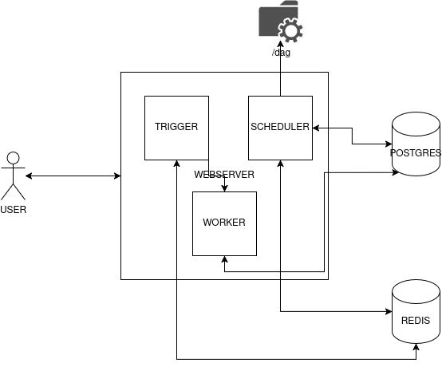

# Fluxo da DAG no Airflow
### "A DAG é adicionada dentro do diretório /dags, onde o SCHEDULER inicia a leitura, verifica se existe uma dag ou uma alteração, agenda a execução pré definida no arquivo, realiza o parse e envia o metadata para o DB(postgres), cacheando no Redis caso a execução precise ser feita fora do que foi agendado, utilizando assim, o TRIGGERER. A execução da task fica para o WORKER. O componente WEBSERVER facilita o debug, ajuda na manipulação da DAG, possui a opção de iniciar, pausar, ou reagendar a task. Dessa maneira o ciclo finaliza." 

